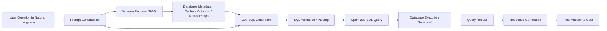

```mermaid
flowchart LR

A[User Question in Natural Language]

B[Prompt Construction]
C[Schema Retrieval 'RAG']
D[Database Metadata - Tables / Columns / Relationships]

E[LLM SQL Generation]
F[SQL Validation / Parsing]
G[Optimized SQL Query]

H[Database Execution 'Teradata']
I[Query Results]
J[Response Generation]
K[Final Answer to User]

A --> B

B --> C
C --> D

D --> E
B --> E

E --> F
F --> G

G --> H
H --> I
I --> J
J --> K
```
